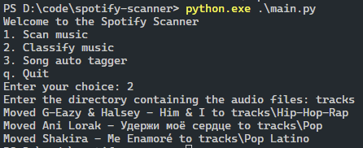

<br/>
<p align="center">
  <a href="https://github.com/TaifAljaloo/Spotify-scanner">
    
  </a>

  <h3 align="center">Spotify Scanner</h3>

  <p align="center">
    Automatically manage your local music library.
    <br/>
    <br/>
    <a href="https://github.com/TaifAljaloo/Spotify-scanner"><strong>Explore the docs »</strong></a>
    <br/>
    <br/>
    <a href="https://github.com/TaifAljaloo/Spotify-scanner/issues">Report Bug</a>
    .
    <a href="https://github.com/TaifAljaloo/Spotify-scanner/issues">Request Feature</a>
  </p>
</p>

<div align="center">

    

</div>


## Table Of Contents

* [About the Project](#about-the-project)
* [Built With](#built-with)
* [Getting Started](#getting-started)
  * [Prerequisites](#prerequisites)
  * [Installation](#installation)
* [Usage](#usage)
* [Contributing](#contributing)
* [Authors](#authors)

## About The Project



This project was initially created as a way to manage my local music library. I wanted to be able to automatically switch to music streaming services such as Spotify, but I also wanted to be able to keep my local music library up to date by automatically classifying and organizing my music files as well as updating their metadata. This project is still in its early stages, but I hope to be able to add more features in the future. Feel free to contribute to this project if you want to help me improve it.

## Built With

This project is built with Python with the help of the following libraries:

* [Spotipy](https://github.com/spotipy-dev/spotipy)
* [Mutagen](https://github.com/quodlibet/mutagen)
* [ShazamIO](https://github.com/dotX12/ShazamIO)

## Getting Started

First of all, you need to install the dependencies listed down below. Then, you need to create a Spotify application and a Spotify user account. You can follow the instructions on the [Spotify for Developers](https://developer.spotify.com/documentation/general/guides/app-settings/) website to create a Spotify application. Once you have created your Spotify application, you need to save the client ID and the client secret somewhere safe because you will need them later. 
To get a local copy up and running follow these simple example steps.

### Prerequisites

To use this project, you need to install the following dependencies:

- [Python 3+](https://www.python.org/downloads/)
- Python libraries:
  ```bash
    pip install spotipy
    pip install shazamio
    pip install mutagen
    pip install shutil
    pip install requests
    ```	
- [FFmpeg](https://ffmpeg.org/download.html)

### Installation

1. Clone the repository
   ```bash

   git clone https://github.com/TaifAljaloo/spotify-scanner.git
   cd spotify-scanner
    ```

2. Create a config file in the root folder 
    ```bash
    touch config.cg
    ```
3. Add the following lines to the config file and replace the values with the values of your Spotify application:
    ```bash
    client_id = "your_client_id"
    client_secret = "your_client_secret"
    username = "your_spotify_username"
    ```
4. Run the script
    ```bash
    python3 main.py
    ```

## Usage

This project is still in its early stages, but you can use it to automatically classify and organize your local music library. You can also use it to automatically update the metadata of your music files. To do so, you need to run the script, pick an option from the menu. eg: 1. Scan local music library. Then, you need to pick a config file from the ones you created before. eg: 1. config.cg.
The script will till if the config file is valid or not.
If the config file is valid, the script will ask you to enter the path of the folder you want to scan. eg: /home/user/Music. Then, the script will ask you to enter the name of the Spotify playlist you want to create. eg: My playlist. If you dont enter a playlist name the script will create one for you. Finally let the script do its job. Once the script is done, you will find the new playlist in your Spotify account. You will also find a log file of the application output aswell as a not_found folder that contains the music files that the script was not able to find on Spotify.


## Contributing

Feel free to contribute to this project if you want to help me improve it.Please make sure to check your spelling and grammar.

### Creating A Pull Request

1. Fork the Project
2. Create your Feature Branch (`git checkout -b feature/AmazingFeature`)
3. Commit your Changes (`git commit -m 'Add some AmazingFeature'`)
4. Push to the Branch (`git push origin feature/AmazingFeature`)
5. Open a Pull Request

## Authors

* **TaifAljaloo** - *Comp Sci Student* - [TaifAljaloo](https://github.com/TaifAljaloo) - *The main dev*
